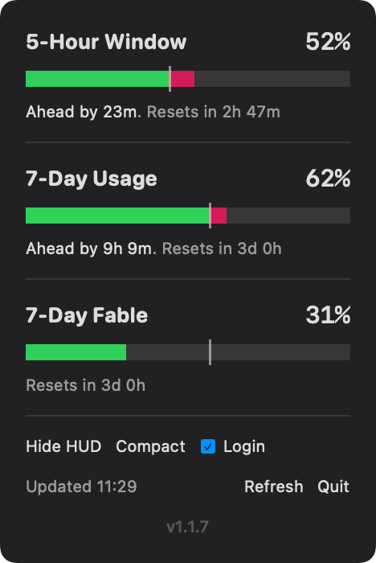

# Claude Usage

A lightweight Mac menu bar app that tracks your Claude rate-limit usage: the 5-hour window, the 7-day window, and model-scoped weekly limits (e.g. a separate Fable allowance) — each with a pace marker showing where you'd be at a steady burn rate.


At a glance you can see:
- **Your current usage** per window (green bar)
- **Where you should be** based on elapsed time (the + marker)
- **Over-pacing** shown in red when usage runs ahead of the time-based target
- **Time remaining** until each window resets

Click the menu bar item for the full breakdown:



## Features

- **Every usage tier** — the 5-hour window, the 7-day window, and any model-scoped weekly limits on your plan, each with its pace marker, an "Ahead by …" readout when you're over pace, and a reset countdown
- **Floating HUD** — an always-on-top mini panel, toggled from the dropdown
- **Compact mode** — collapses the menu bar item to a single "C" (turns on automatically on narrow screens)
- **Launch at Login** — a checkbox in the dropdown
- **Quiet failure handling** — keeps the last-known bars through network hiccups and busy servers, and says clearly when you actually need to sign in again

## Prerequisites

You need [Claude Code](https://docs.anthropic.com/en/docs/claude-code) installed and authenticated via browser-based OAuth login. The app reads the OAuth token from the macOS Keychain entry that Claude Code creates (`Claude Code-credentials`). Works with Claude Max, Pro, and Team plans.

If you authenticated using `claude setup-token` instead of the browser flow, the token won't have the required scope. To fix this:
1. Delete the keychain entry: `security delete-generic-password -s "Claude Code-credentials"`
2. Restart Claude Code and authenticate via browser when prompted

## Install

### From the installer package

Download the latest `ClaudeUsage-<version>.pkg` from [Releases](https://github.com/michielb/claude-usage/releases) and run it. The package is code-signed and notarized.

### From source

```sh
swift build -c release
mkdir -p /Applications/ClaudeUsage.app/Contents/{MacOS,Resources}
cp .build/release/ClaudeUsage /Applications/ClaudeUsage.app/Contents/MacOS/
cp Info.plist /Applications/ClaudeUsage.app/Contents/
cp Resources/AppIcon.icns /Applications/ClaudeUsage.app/Contents/Resources/
open /Applications/ClaudeUsage.app
```

Or build the full signed `.pkg` installer with `bash scripts/build.sh <version>` (requires Developer ID certificates — see the comments in `scripts/build.sh`).

To launch at login, use the **Login** checkbox in the dropdown.

## How it works

- Polls `https://api.anthropic.com/api/oauth/usage` every 3 minutes
- Reads the OAuth token from the macOS Keychain (created by Claude Code)
- Refreshes automatically on wake from sleep
- No Dock icon — runs as a menu bar-only app

## Requirements

- macOS 14+
- Claude Max, Pro, or Team subscription with Claude Code authenticated via browser OAuth
- Swift 6 (only if building from source)
